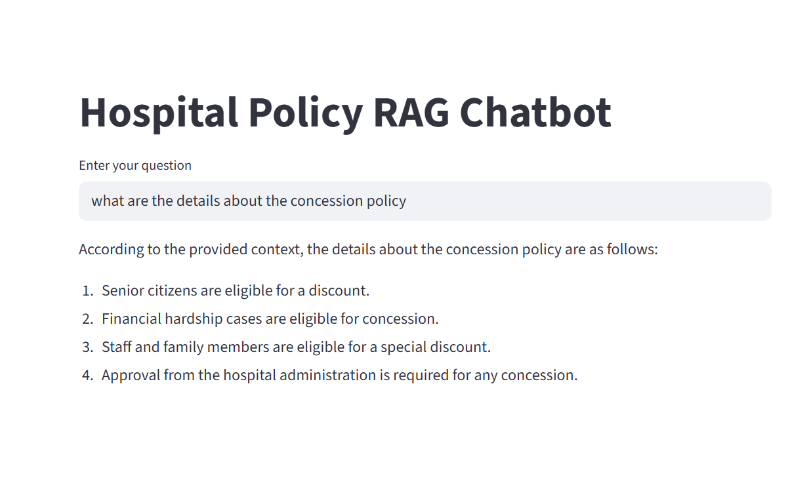
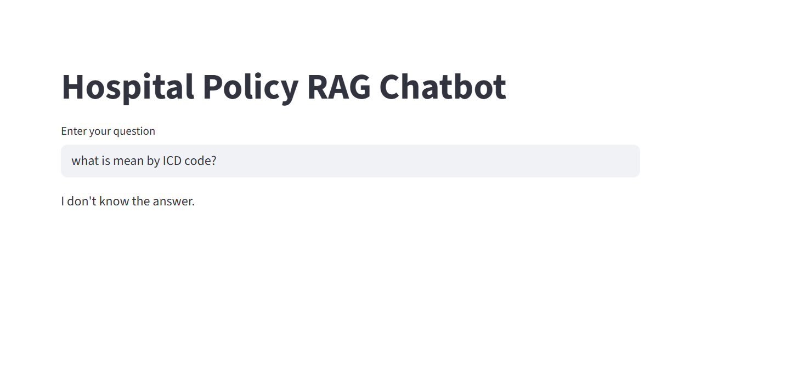

# 🏥 Hospital Policy RAG Chatbot

An intelligent **Retrieval-Augmented Generation (RAG)** chatbot that answers hospital policy-related questions using Large Language Models (LLMs) and semantic search.

This project demonstrates how to combine **document retrieval + LLM reasoning** to generate accurate, context-aware answers from hospital policy documents.

---

## 🚀 Why This Project?

Hospital staff often struggle to quickly find information across multiple policy documents.

This chatbot solves that by:
- 🔍 Retrieving relevant policy content  
- 🧠 Generating contextual answers using LLM  
- ❌ Reducing hallucinations by grounding responses in real data  

---

## ✨ Features

- 💬 Ask natural language questions  
- 📄 Context-based answers from policy documents  
- 🔍 Semantic search using embeddings  
- 🧠 LLM-powered responses  
- 🔐 Secure API key handling using `.env`  

---

## 🧠 Tech Stack

- **Python**
- **LangChain**
- **OpenAI / Groq (LLM)**
- **FAISS / Chroma (Vector DB)**
- **Embeddings (OpenAI / HuggingFace)**

---

## ⚙️ How It Works (RAG)

User Question → Retriever → Context → LLM → Answer

1. User asks a question  
2. Retriever finds relevant document chunks  
3. Context is passed to the LLM  
4. LLM generates an accurate response  

---

## 📸 Demo

### Example Response

### Example Response for outside data

---

## 💡 Example Queries

- What is the hospital leave policy?  
- What are patient admission rules?  
- Explain discharge procedures  
- What are visiting hours?  

---

## 🧾 Sample Output
Q: What is the hospital leave policy?

A: Employees are entitled to annual leave based on their tenure.
Leave requests must be approved by the reporting manager and
documented according to hospital guidelines.

---

## 📂 Project Structure
hospital-policy-rag-chatbot/
│
├── app.py
├── data/
├── assets/
├── requirements.txt
├── .env.example
├── .gitignore
└── README.md

---

## ▶️ Installation & Setup

### 1. Clone the repository 
git clone https://github.com/Namitha-C-Anto/hospital-policy-rag-chatbot.git
cd hospital-policy-rag-chatbot

### 2. Create virtual environment
python -m venv .venv
.venv\Scripts\activate   # Windows

### 3. Install dependencies
pip install -r requirements.txt

### 4. Configure environment variables
Create a .env file:
OPENAI_API_KEY=your_openai_api_key
GROQ_API_KEY=your_groq_api_key

### 5. Run the application
streamlit run app.py

